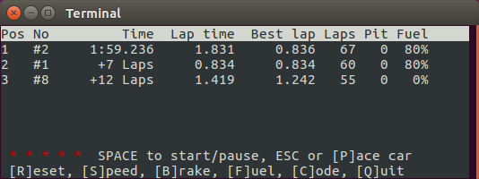

:mod:`carreralib` --- Python interface to Carrera® DIGITAL 124/132 slotcar systems
==================================================================================

.. module:: carreralib

This module provides a Python interface to Carrera® DIGITAL 124/132
slotcar systems connected via the serial port.

.. code-block:: pycon

   >>> from carreralib import ControlUnit
   >>> cu = ControlUnit('/dev/ttyUSB0')  # or something like 'COM3' on Windows
   >>> cu.version()
   b'5331'
   >>> cu.request()
   Status(fuel=(15, 15, 15, 15, 15, 15, 0, 0), start=0, mode=6,
          pit=(False, False, False, False, False, False, False, False),
          display=8)
   >>> cu.start()
   >>> cu.request()
   Status(fuel=(15, 15, 15, 15, 15, 15, 0, 0), start=1, mode=6,
          pit=(False, False, False, False, False, False, False, False),
          display=8)
   >>> cu.start()
   >>> cu.request()
   Timer(address=1, timestamp=243019, sector=1)
   >>> cu.request()
   Timer(address=0, timestamp=245704, sector=1)

Demo RMS
------------------------------------------------------------------------

For demonstration purposes, the :mod:`carreralib` module can be used
from the command line to run a simple curses-based race management
system (RMS)::

  python3 -m carreralib /dev/ttyUSB0

When called without a device name or path, this will list command line
options and serial devices that a Control Unit may be connected to::

  $ python3 -m carreralib
  usage: python -m carreralib [-h] [-l LOGFILE] [-t TIMEOUT] [-v] [DEVICE]

  positional arguments:
    DEVICE                the Control Unit device, e.g. a serial port or MAC address

  options:
    -h, --help            show this help message and exit
    -l LOGFILE, --logfile LOGFILE
                          where to write log messages
    -t TIMEOUT, --timeout TIMEOUT
                          maximum time in seconds to wait for Control Unit
    -v, --verbose         write more log messages

  devices:
    /dev/ttyUSB0	USB-Serial Controller

Within the RMS, use the space key to start or pause a race, ``R`` to
reset a race, and ``Q`` to quit.

Control Unit Firmware
------------------------------------------------------------------------

To show the current firmware version of your Control Unit, use::

  python3 -m carreralib.fw /dev/ttyUSB0

.. note::

  Trying to update the firmware of your Control Unit is a potentially
  dangerous operation that may wreck your hardware.  Use at your own
  risk!

To upgrade (or downgrade) your Control Unit's firmware, given an ASCII
firmware file, use::

  python3 -m carreralib.fw /dev/ttyUSB0 digital_blackbox_NF_V337.HMF 

.. note::

  Control Unit firmware are the intellectual property of Carrera Toys
  GmbH, and are only provided by the copyright holders.  Please do
  *not* ask for firmware files here!

API
------------------------------------------------------------------------

The :class:`ControlUnit` class encapsulates a connection to a Carrera®
DIGITAL 124/132 Control Unit (CU) and provides all the features needed
to implement a custom race management system (RMS).

Note that :class:`ControlUnit` uses zero-based controller addresses, so
:const:`0` corresponds to controller #1, :const:`6` is the address the
autonomous car, and :const:`7` the address of the pace car.

.. autoclass:: ControlUnit
   :members:

   `device` should name a serial port, e.g. ``/dev/ttyUSB0`` on
   GNU/Linux or ``COM3`` on Windows.  Additional keyword arguments
   will be passed to the underlying :class:`Connection` object.

Connection Module
------------------------------------------------------------------------

This module is mostly of interest to developers who want to create
their own connection implementation, for example to use a Bluetooth
implementation.

.. automodule:: carreralib.connection
   :members:

Protocol Module
------------------------------------------------------------------------

.. module:: carreralib.protocol

This module provides utility functions for dealing with the Carrera®
DIGITAL 124/132 protocol.

.. autofunction:: pack

   Similar to :func:`struct.pack`, this function performs conversion
   between Python values and binary protocol data.  Format strings may
   contain the following characters:

   +------------+----------------------------+-------------------------------+
   | Format     | Python type                | Value                         |
   +============+============================+===============================+
   | :const:`B` | :class:`int`               | unsigned byte                 |
   +------------+----------------------------+-------------------------------+
   | :const:`c` | :class:`bytes` of length 1 | a single ASCII character      |
   +------------+----------------------------+-------------------------------+
   | :const:`C` | no value                   | check sum                     |
   +------------+----------------------------+-------------------------------+
   | :const:`I` | :class:`int`               | 32-bit unsigned integer       |
   +------------+----------------------------+-------------------------------+
   | :const:`s` | :class:`bytes`             | ASCII string                  |
   +------------+----------------------------+-------------------------------+
   | :const:`x` | no value                   | padding/ignored               |
   +------------+----------------------------+-------------------------------+
   | :const:`Y` | :class:`int`               | nibble or *nybble*            |
   +------------+----------------------------+-------------------------------+

   As with :func:`struct.pack`, a format character may be preceded by
   an integral count.  For the :const:`s` format character, the count
   is interpreted as the length of the bytes.  For the :const:`C`
   format character, the count is interpreted as an *offset* in the
   generated buffer from which the checksum should be calculated.  For
   the other format characters, the count is simply interpreted as a
   repeat count.

.. autofunction:: unpack

.. autofunction:: chksum
